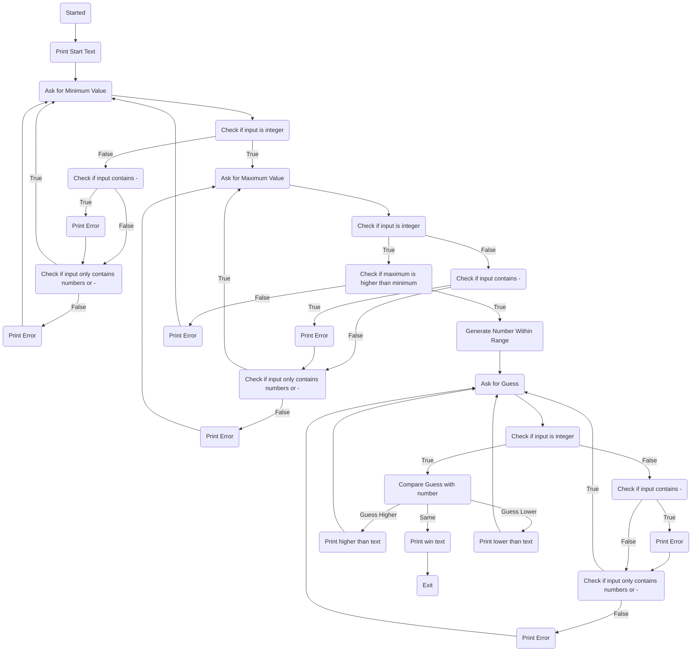

```mermaid

flowchart TB
    id1(Started)
    id2(Print Start Text)

    id3(Ask for Minimum Value)

    id4(Check if input is integer)
    id5(Check if input contains -)
    id6(Print Error)
    id7(Check if input only contains numbers or -)
    id8(Print Error)

    id9(Ask for Maximum Value)
    id10(Check if input is integer)
    id11(Check if input contains -)
    id12(Print Error)
    id13(Check if input only contains numbers or -)
    id14(Print Error)

    id15(Check if maximum is higher than minimum)
    id16(Print Error)

    id17(Generate Number Within Range)
    
    id18(Ask for Guess)
    id19(Check if input is integer)
    id20(Check if input contains -)
    id21(Print Error)
    id22(Check if input only contains numbers or -)
    id23(Print Error)

    id24(Compare Guess with number)
    id25(Print higher than text)
    id26(Print win text)
    id27(Print lower than text)

    id28(Exit)


    id1 --> id2
    id2 --> id3

    id3 --> id4
    id4 -->|False| id5
    id5 -->|False| id7
    id5 -->|True| id6
    id6 --> id7
    id7 -->|False| id8
    id8 --> id3
    id7 -->|True| id3

    id9 --> id10
    id10 -->|False| id11
    id11 -->|False| id13
    id11 -->|True| id12
    id12 --> id13
    id13 -->|False| id14
    id14 --> id9
    id13 -->|True| id9

    id4 -->|True| id9
    id10 -->|True| id15

    id15 -->|False| id16
    id16 -->id3
    id15 -->|True| id17

    id17 --> id18
    id18 --> id19
    id19 -->|False| id20
    id20 -->|True| id21
    id21 --> id22
    id20 -->|False| id22
    id22 -->|False| id23
    id23 --> id18
    id22 -->|True| id18
    id19 -->|True| id24

    id24 -->|Guess Higher| id25
    id25 --> id18
    id24 -->|Same| id26
    id26 --> id28
    id24 -->|Guess Lower| id27
    id27 --> id18

```

### Documentation
This is the Flowgorithm option but done in Python.
